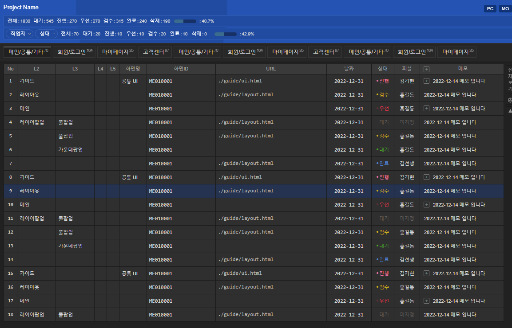
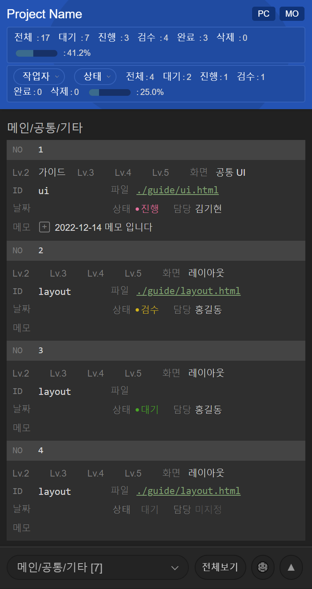

# ia
PROJECT IA

Now converting jQuery version to pure javascript


###  설정 [ia.opts]
```js
usrs: [  //  작업자
	"김기현", "홍길동", "김선생", "박진상", "이미나", "미지정",
],
stts: [  // 상태값
	"대기", "진행", "검수", "완료", "삭제", "우선",
],
stxt: { /* 상태값에 class */
	"대기": "sty",
	"진행": "ing",
	"검수": "chk",
	"완료": "com",
	"삭제": "del",
	"우선": "wan",
},
```

 <br>
